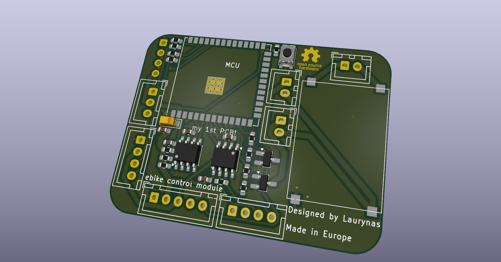
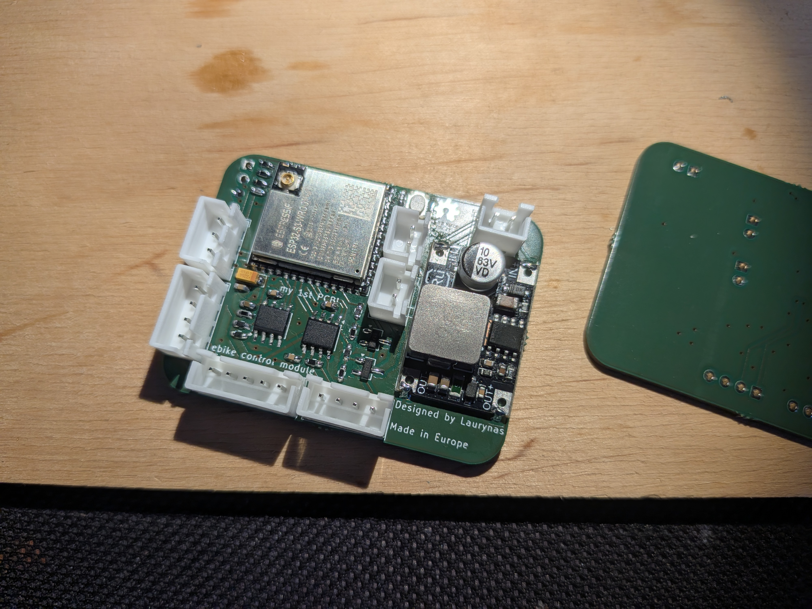

# Torque Sensor Controller for VESC E-Bike Assist

This repository contains hardware and firmware for an ESP32-S3 based torque sensor controller that talks to a [VESC](https://github.com/vedderb/bldc) over CAN bus.

The controller reads bottom bracket torque and cadence, computes an assist current target, and sends motor current commands to the VESC. It also tracks odometer data with FRAM-backed persistence and exposes a local web UI for status, tuning, and OTA firmware updates.

## Project Status

This is an actively developed personal project used as a practical internal reference.

## Features

- Torque and cadence based pedal-assist control loop (10 ms period).
- CAN communication to VESC at 500 kbit/s.
- Odometer and speed tracking with persistent FRAM storage.
- Wi-Fi station mode with fallback access point mode.
- Embedded HTTP console for telemetry, runtime config, and calibration.
- OTA firmware upload endpoint.
- Optional TCP bridge for VESC tool connectivity over Wi-Fi.

## Repository Layout

- `lauryno_torque_controller_hardware/`: KiCad schematic, PCB, and BOM.
- `lauryno_torque_controller_software/`: PlatformIO firmware project.
- `documents/`: reference documents, including [torque sensor datasheet](./documents/S135daff485444e569ac136541eaddd83u.pdf).
- `images/`: board render and finished board photo.

## Hardware





Hardware highlights:

- ESP32-S3 module as main controller.
- CAN transceiver interface to VESC.
- FRAM storage for high-endurance persistent data.
- 2 MOSFET outputs and a buck stage for front/rear LED lighting.

The PCB was designed to fit AISLER simple 2-layer constraints for low-cost fabrication.

Available hardware design artifacts:

- Schematic: [lauryno_torque_controller.kicad_sch](./lauryno_torque_controller_hardware/lauryno_torque_controller.kicad_sch)
- PCB layout: [lauryno_torque_controller.kicad_pcb](./lauryno_torque_controller_hardware/lauryno_torque_controller.kicad_pcb)
- BOM: [lauryno_torque_controller.csv](./lauryno_torque_controller_hardware/lauryno_torque_controller.csv)

## Firmware Architecture

Main runtime modules:

- `PedalAssistManager`: torque/cadence processing and motor current command generation.
- `VescCan`: CAN transport and VESC status/current command handling.
- `OdometerManager`: wheel pulse tracking, speed estimation, and persistence.
- `FramStorage`: I2C FRAM read/write backend.
- `NetworkManager`: station connect with timeout and fallback AP startup.
- `OtaHttpServer`: web UI, REST endpoints, and OTA upload flow.
- `VescTcpBridge`: optional TCP bridge (disabled by default).

Task model:

- Pedal-assist control task on core 1.
- Communication task (HTTP + TCP bridge update loop) on core 0.
- Main loop polls CAN and updates odometer processing.

## Quick Start (Short)

1. Install PlatformIO CLI.
2. Open terminal in `lauryno_torque_controller_software/`.
3. Create a local `platformio.secrets.ini` (this file is git-ignored):

```ini
[env:esp32-s3-devkitc-1]
build_flags =
	-DWIFI_STA_SSID=\"YOUR_WIFI_SSID\"
	-DWIFI_STA_PASSWORD=\"YOUR_WIFI_PASSWORD\"
```

4. Build firmware:

```bash
pio run -e esp32-s3-devkitc-1
```

5. Upload over USB:

```bash
pio run -e esp32-s3-devkitc-1 -t upload
```

6. Open serial monitor:

```bash
pio device monitor -b 115200
```

## First Boot Notes

- Device tries configured Wi-Fi STA first, then falls back to AP mode if connection times out.
- AP SSID format: `TorqueCtrl-Setup-<chipid>`.
- mDNS host: `lauryno-dviratis.local`.
- HTTP console runs on port `80`.
- VESC TCP bridge port: `65102` (off by default, can be toggled from API/UI).

## Runtime Configuration and API

Key endpoints:

- `GET /health`
- `GET /api/vesc/status`
- `GET /api/bridge`
- `POST /api/bridge/enable`
- `POST /api/bridge/disable`
- `GET /api/odometer/status`
- `GET /api/odometer/config`
- `POST /api/odometer/config`
- `GET /api/pedal/status`
- `GET /api/pedal/config`
- `POST /api/pedal/config`
- `POST /api/pedal/calibrate_zero`

Important operation detail:

- Run pedal sensor zero calibration after installation or sensor replacement using `POST /api/pedal/calibrate_zero`.

## OTA Update

Firmware can be uploaded from the web UI or directly by HTTP multipart upload:

```bash
curl -F "file=@.pio/build/esp32-s3-devkitc-1/firmware.bin" http://lauryno-dviratis.local/api/update
```

After a successful upload, the controller restarts automatically.

## Configuration Baseline

Selected defaults from firmware config:

- CAN: TX GPIO 15, RX GPIO 7, 500000 bit/s.
- VESC IDs: local controller `42`, target controller `69`.
- Odometer hall input: GPIO 9.
- FRAM I2C: SDA GPIO 6, SCL GPIO 5, base address `0x50`.
- Torque ADC input: GPIO 1.
- Cadence input: GPIO 2.

See `lauryno_torque_controller_software/include/app_config.h` for the full set of constants and limits.

## Testing

No automated unit tests are currently implemented. The `lauryno_torque_controller_software/test/` directory is present for future PlatformIO test runner coverage.

## Open-Source License

This project is licensed under **CERN Open Hardware Licence Version 2 - Permissive** (`CERN-OHL-P-2.0`).

See the repository [LICENSE](./LICENSE) file for the project license notice and the official CERN-OHL-P v2 text reference.

## References

- VESC firmware project: [https://github.com/vedderb/bldc](https://github.com/vedderb/bldc)
- Torque sensor reference document: [S135daff485444e569ac136541eaddd83u.pdf](./documents/S135daff485444e569ac136541eaddd83u.pdf)

